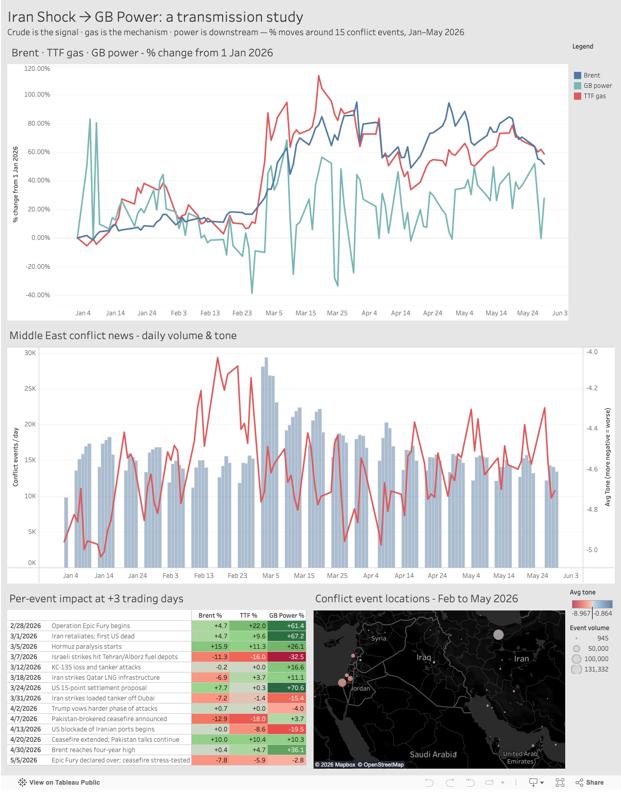
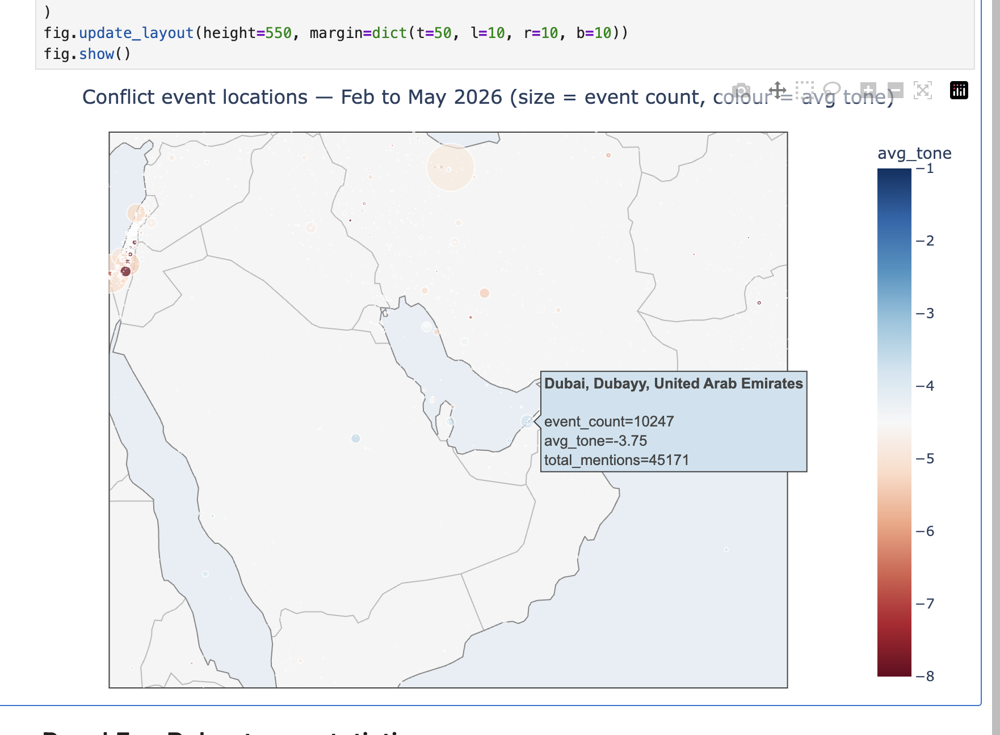
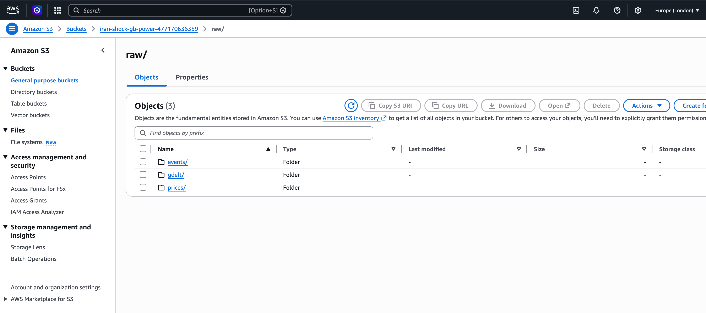
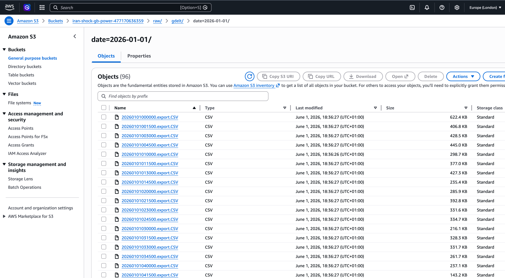
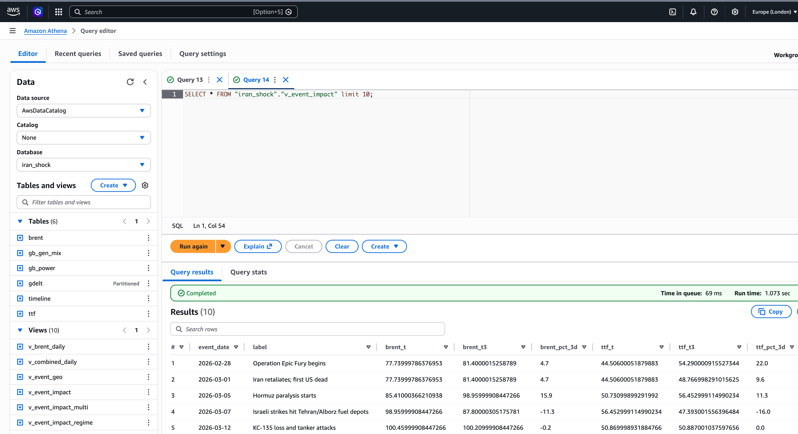

# Iran Shock Transmission to GB Power

An event study of whether the 2026 Iran conflict (Operation Epic Fury) transmitted from crude oil into GB wholesale power, and via which mechanism.

On days where gas covered at least 30% of the GB transmission stack, TTF↔GB power Spearman ρ was **+0.90**. On low-gas days it dropped to **+0.60**. European gas prices transmit into GB power when gas is at the margin; the link loosens when renewables and nuclear displace it. Merit-order theory, confirmed in the data. Full numbers in the Analysis section below.

## Dashboard

[View here](https://public.tableau.com/views/IranShock-GBPower/Dashboard)



There is also a **[notebook](/notebooks/06_dashboard.ipynb)**



---

## Analysis

### Window and dataset

1 January to 31 May 2026. 102 trading days of Brent, TTF and GB MID. 151 days of FUELHH. 16 million GDELT events. A 15-event hand-curated timeline from the long-form PDF.

### Conditional transmission

On days where gas covered at least 30% of the GB transmission stack (n=8 timeline events), TTF↔GB power Spearman ρ was +0.90 (Pearson r = +0.92). On low-gas days (n=6 with valid t+3) it dropped to +0.60. Same shock, different transmission, because gas was no longer at the margin.

### Forward mechanism check (Clean Spark Spread)

Theoretical CCGT margin = TTF × heat rate × EUR/GBP + UKA × emissions factor. The UKA proxy is the KRBN carbon ETF, anchored to £72/tCO₂ on 2 January. Across 64 high-gas days observed GB power tracked the theoretical margin at Pearson r = +0.61. Across 38 low-gas days the correlation fell to +0.11. Merit-order theory holds when its precondition is met and fails when it isn't. The high-gas mean residual was +£14.7/MWh, the usual operating premium above marginal cost.

### Inverse mechanism check (Implied TTF)

Inverting the algebra to compute implied TTF from observed power gives r = +0.63 high-gas, r = +0.12 low-gas against actual TTF. Two independent algebraic projections, one answer. The basis on high-gas days was −€9.3/MWh (scarcity premium above CCGT cost). On low-gas days it flipped to +€4.4/MWh (renewables and nuclear pulling power below the CCGT margin).

### News channel is LNG-specific

Composite GDELT GKG signals: oil-themed (ECON_OIL theme plus Kharg Island entity mentions, Iran's oil export terminal); LNG-themed (Ras Laffan entity mentions, Qatar's LNG terminal). At t+3 across 99 trading-day pairs the LNG signal explains 8.3% of TTF variance against 1.6% for oil. The gas channel reads LNG news at roughly five times the strength of oil news. The oil signal is the marginally stronger Brent driver (R² 5.0% vs 3.3%), as the symmetric prediction expects. For GB power, LNG Spearman ρ is +0.27 against +0.16 for oil. The largest single-day LNG cluster aligned with the 18 March Qatar LNG strike; TTF then ran +9.1% over the next three trading days and GB power +23.6%.

### Cross-commodity coupling

Brent and TTF moved together across the 14 usable timeline events at Pearson r = +0.75, Spearman ρ = +0.83. Bootstrap 95% CI [+0.48, +0.91]. P(r > 0) = 100%. The LNG-substitution channel is robust at this sample size.

### n=14 caveat softened for power

A 1,000-iteration placebo permutation test (sample 14 random non-event trading days, compute the t+3 mean) put real-event GB power at the 98th percentile of the placebo distribution signed, 99th percentile absolute. Brent and TTF signed means sat at placebo median because event impacts went both directions and cancelled. Power amplified them.

### Free GDELT win that was already in the data

Mentions-weighted GoldsteinScale × NumMentions correlates with TTF t+3 at r = −0.33. AvgTone, the obvious tone metric we had been using, correlates at r = −0.15. Goldstein is political-science-calibrated by event type rather than dictionary tone, and it was already in the Events file the project pulls.

### Caveats worth flagging

n=14 to 15 timeline events. Results are consistent with the merit-order mechanism rather than significant under α=0.05 with multiple-comparison correction. MID is continuous-intraday wholesale, not the day-ahead auction. Cash-out and PAR1 amplification sit in a separate layer not covered here. The LNG signal is dominated by one entity (Ras Laffan), because Iran's strikes targeted it specifically; a longer historical sample would test whether the asymmetry generalises. The Brent ↔ power link outside the gas channel is weaker than the gas channel itself. Crude is the headline; gas is the bridge.

---

## Getting started

### Prerequisites

- **macOS or Linux** (Windows via WSL2 should also work).
- **Python 3.13+** — `uv` will install the right version automatically if missing.
- **~10 GB of free disk** for the full GDELT ingestion at 15-minute cadence (config-tunable; hourly sample uses ~2 GB).
- **Network access** to Yahoo Finance, Elexon BMRS, and `data.gdeltproject.org`.

### One-time install

```bash
# Install uv (the Python package manager used throughout — replaces pip/poetry/venv)
curl -LsSf https://astral.sh/uv/install.sh | sh

# Clone the repo and then cd into it
cd iran-shock-gb-power

# Restore the environment — uv reads pyproject.toml + uv.lock and creates .venv automatically
uv sync
```

### What gets ingested

| Source | Endpoint | What | Volume |
|---|---|---|---|
| **Brent** | Yahoo Finance `BZ=F` (via `yfinance`) | front-month crude futures, daily close (USD) | ~100 trading days |
| **TTF gas** | Yahoo Finance `TTF=F` (via `yfinance`) | European gas benchmark, daily close (€/MWh) | ~100 trading days |
| **GB MID power** | Elexon BMRS `/balancing/pricing/market-index?dataProviders=APXMIDP` | half-hourly Market Index Price → daily mean (£/MWh) | ~150 days (7-day calendar) |
| **GB FUELHH** | Elexon BMRS `/datasets/FUELHH` | half-hourly generation by fuel → daily fuel shares | ~150 days |
| **GDELT events** | `data.gdeltproject.org/gdeltv2/*.export.CSV.zip` | global news events with tone, geo, actors | ~12–16M rows (full cadence) |
| **Timeline** | hand-curated CSV in `data/epic_fury_timeline.csv` | 15 PDF-sourced events Feb–May 2026 | 15 rows |

Yahoo for Brent + TTF + Elexon for GB power + GDELT for news — all four are **free and require no API key**.

### Run the pipeline

```bash
uv run iran-shock-ingest-prices          # 1. Brent + GB MID + TTF + gen mix (~30s)
uv run iran-shock-ingest-gdelt           # 2. GDELT 15-min files            (1-3 hours)
uv run iran-shock-build                  # 3. load -> DuckDB; materialise views (~1m)
```

The three scripts are **idempotent and resumable** — safe to interrupt with Ctrl+C and re-run; already-downloaded files skip in milliseconds. `iran-shock-ingest-gdelt` can run unattended overnight.

When `iran-shock-build` finishes its sanity sweep, you have a populated `iran.duckdb` with **9 raw tables** (`timeline`, `brent`, `gb_power`, `ttf`, `gb_gen_mix`, `uka_proxy`, `gdelt`, `gdelt_gkg`, `finbert_scores`) and **24 views** ready for analysis (10 originals + 3 methodology hardening + 3 Clean Spark Spread + 1 events features + 4 GKG + 1 FinBERT + 1 implied TTF + 1 LNG-vs-oil signal).

### Open the analysis

```bash
uv run jupyter lab notebooks/06_dashboard.ipynb
```

Jupyter Lab starts at <http://localhost:8888/lab/tree/> with the dashboard notebook open. Run all cells (Kernel → Restart and Run All) to render six panels: hero chart, news signal, event-impact table, conflict map, robustness stats, and conditional-transmission test.

Sanity-check what landed in DuckDB from the command line:

```bash
uv run python -c "import duckdb; print(duckdb.connect('iran.duckdb', read_only=True).execute('SELECT count(*) FROM gdelt').df())"
```

Or browse the DuckDB GUI:

```bash
uv run duckdb iran.duckdb -readonly -ui    # opens at http://localhost:4213/
```

## The question

When the Iran conflict escalated (28 February 2026), did the shock move from Brent crude into GB wholesale power — and is the mechanism *gas-as-marginal-fuel* rather than direct oil pricing?

Three series on one daily timeline (1 January – 31 May 2026): a GDELT conflict-news signal, Brent crude, TTF European gas, and GB Market Index Price for power. A 15-event curated conflict timeline anchors the event study. GB FUELHH generation-mix data tests the mechanism conditionally.

## Architecture

```text
GDELT 2.0 events ─┐                                            ┌─► Tableau Public (publish)
Brent (yfinance)  │                                            │
TTF (yfinance)    ├─► CLI ingest ─► data/raw/  ─► CLI build ─► iran.duckdb (24 views) ─┤
GB MID (Elexon)   │                                            │
GB FUELHH (Elexon)┘                                            └─► notebook 06 ─► plotly dashboard
                                                                                  (optional: HTML -> GitHub Pages)

                                                                                    │
                                                                                    └─► S3 + Athena (cloud port — same SQL)
```

Same SQL runs in DuckDB locally and Athena in the cloud.

## Cloud port — AWS S3 + Athena

The pipeline ports to the cloud unchanged: local `data/raw/` mirrors the S3 layout, and the same views run on Athena with three dialect swaps (`strptime → date_parse`, `::TYPE → CAST(… AS TYPE)`, `+ INTERVAL → date_add`). Table DDL and view ports are committed in [`pipeline/athena_tables.sql`](pipeline/athena_tables.sql) and [`pipeline/athena_views.sql`](pipeline/athena_views.sql).

**S3** — raw data Hive-partitioned by date (`raw/gdelt/date=YYYY-MM-DD/`, plus `prices/` and `events/`):





**Athena** — the same 6 tables + 10 views; querying the headline event-impact view returns the same numbers as the local DuckDB:



## Repo structure

```text
src/iran_shock/    columns.py · config.py · gdelt.py · prices.py · cli.py
sql/               v_*.sql — canonical views (24 local; 10 ported to Athena)
notebooks/         01–03 (EDA tutorials) · 04–05 (read-only walkthroughs) · 06 (dashboard)
data/              epic_fury_timeline.csv · raw/ (gitignored) · exports/ (committed)
pipeline/          S3 + Athena DDL for the cloud port (Stage 3)
logs/              ingest_*.log · build.log (gitignored)
```

## Tech stack

- **Python** with `uv` for everything; **pandas**, **plotly**, **scipy**, **duckdb**, **yfinance**, **requests**
- **DuckDB** locally; **Athena** in the cloud (Stage 3); same SQL with three dialect swaps
- **Tableau Public** for the published dashboard; **plotly + GitHub Actions + GitHub Pages** for the auto-refreshing variant
- **AWS** (S3, Glue Data Catalog, Athena) for the cloud port